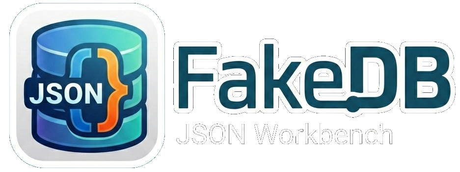

# <div align="center"></div>

FakeDB Studio is a desktop application built with Electron, React, and TypeScript that provides a MySQL Workbench-like experience tailored for `FakeDB`.

`FakeDB` is a JSON-based database system designed to run locally when you do not have a driver for a real database, or when you need to quickly simulate a persistent data structure during development, testing, or prototyping.

With FakeDB Studio, you can manage a local FakeDB instance through a dedicated graphical interface, acting as a custom MySQL Workbench for FakeDB.

### What the application does

- Lets you open and manage a local FakeDB database.
- Provides a desktop UI for working with JSON-backed data.
- Helps simulate database operations when a specific database driver is not available.
- Centralizes local database management for development and debugging.

### Requirements

- Node.js 18 or later
- npm

### Run in development

1. Install dependencies:

```bash
npm install
```

2. Start the application:

```bash
npm run dev
```

### Run on Windows

Open PowerShell or Command Prompt in the project folder and run:

```bash
npm install
npm run dev
```

To generate a Windows build:

```bash
npm run build:win
```

### Run on Linux

Open a terminal in the project folder and run:

```bash
npm install
npm run dev
```

To generate a Linux build:

```bash
npm run build:linux
```

### Run on macOS

Open Terminal in the project folder and run:

```bash
npm install
npm run dev
```

To generate a macOS build:

```bash
npm run build:mac
```

### Cross-platform build

To run the standard project build:

```bash
npm run build
```
